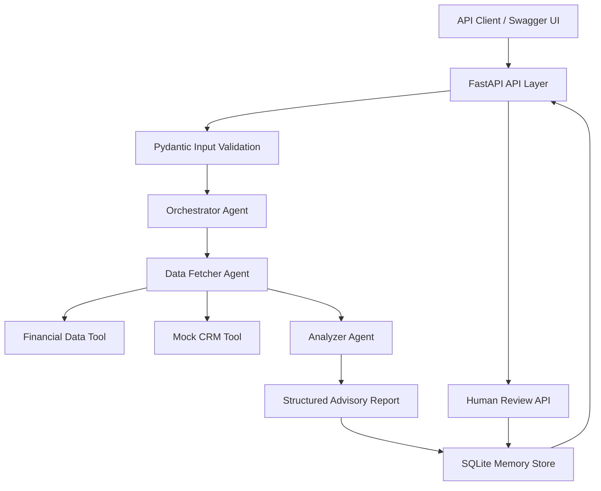

# Wealth Advisor Assistant

A modular, multi-agent financial analysis system built with **Python, FastAPI, Pydantic, and SQLite**. The application validates client financial data, enriches it with mock CRM context, calculates cash-flow summaries, flags potentially unusual transactions, produces structured risk signals, and supports persistent report history and human-review records.

> **Project type:** Technical assessment / proof of concept
> **API framework:** FastAPI
> **Data validation:** Pydantic
> **Persistence:** SQLite
> **Testing:** pytest
> **Python:** 3.11+

---

## Table of Contents

- [Overview](#overview)
- [Problem Statement](#problem-statement)
- [Objectives](#objectives)
- [Features](#features)
- [Architecture](#architecture)
- [Agent Responsibilities](#agent-responsibilities)
- [Request Lifecycle](#request-lifecycle)
- [Technology Stack](#technology-stack)
- [Project Structure](#project-structure)
- [Getting Started](#getting-started)
- [Running the Application](#running-the-application)
- [API Reference](#api-reference)
- [Input Data Model](#input-data-model)
- [Financial Analysis and Anomaly Detection](#financial-analysis-and-anomaly-detection)
- [Persistence and Memory](#persistence-and-memory)
- [Human-in-the-Loop Review](#human-in-the-loop-review)
- [Error Handling and Logging](#error-handling-and-logging)
- [Testing](#testing)
- [Sample Request](#sample-request)
- [Sample Response](#sample-response)
- [Design Decisions and Trade-offs](#design-decisions-and-trade-offs)
- [Assumptions](#assumptions)
- [Known Limitations](#known-limitations)
- [Security and Production Considerations](#security-and-production-considerations)
- [Future Improvements](#future-improvements)
- [Conclusion](#conclusion)

---

## Overview

The Wealth Advisor Assistant is a lightweight multi-agent application that converts validated financial inputs into a structured, explainable analysis report.

The system is designed around three primary responsibilities:

1. **Data retrieval and enrichment:** Load client financial data and retrieve supplementary CRM context through interchangeable tool interfaces.
2. **Financial analysis:** Calculate observed income, expenses, net cash flow, category-level spending, potential transaction anomalies, and risk signals.
3. **Orchestration and reporting:** Coordinate the agents, handle failures, generate a structured report, persist the result, and expose retrieval and human-review APIs.

The current implementation uses deterministic Python logic rather than a generative language model. This makes the analysis reproducible and its calculations inspectable, while leaving room for future integration with LLM-based explanation or recommendation components.

The application is intended as a demonstrable foundation for an advisor-assistance workflow, not as a production financial-advice engine.

## Problem Statement

Financial information is often distributed across transaction records, account balances, client profiles, and CRM systems. Reviewing this information manually can make it difficult to identify cash-flow pressure, unusual spending, and information that warrants follow-up.

This project explores a modular workflow that can:

- Validate incoming client data before analysis.
- Enrich financial records with relationship-management context.
- Produce consistent financial summaries.
- Flag transactions that meet a configurable heuristic threshold.
- Explain risk signals using supporting evidence.
- Store analysis reports for later retrieval.
- Record human review decisions against persisted reports.

The objective is to demonstrate clear component boundaries, structured outputs, error handling, and testable business logic.

## Objectives

The implementation addresses the following engineering objectives:

- Build a multi-agent workflow with an orchestrator and specialized agents.
- Keep external data access behind tool interfaces.
- Validate financial inputs with explicit types and constraints.
- Avoid silently combining transactions from different currencies.
- Return structured, machine-readable analysis reports.
- Persist reports and review records in SQLite.
- Support retrieval by report ID and client ID.
- Expose an interactive API through FastAPI's OpenAPI documentation.
- Test core business logic and API behavior independently.
- Document assumptions, trade-offs, and known limitations.

## Features

### Financial analysis

- Calculate observed transaction credits and debits.
- Calculate net cash flow.
- Aggregate debit transactions by category.
- Count transactions and identify currencies.
- Reject mixed-currency transaction sets when conversion has not been implemented.

### Transaction anomaly detection

- Identify debit transactions that meet a heuristic unusual-amount threshold.
- Compare a transaction with other debit transactions when comparison data is available.
- Apply a minimum amount threshold.
- Assign a severity based on the amount relative to the threshold.
- Generate a corresponding risk signal for each detected anomaly.

### Risk signals

The current analyzer can produce signals for:

- Negative observed cash flow.
- Unusual transactions.
- Negative reported credit-card balances that require clarification of the source system's sign convention.

Each risk signal includes a type, severity, description, supporting evidence, and recommended follow-up action.

### Multi-agent orchestration

- Separate data fetching from financial analysis.
- Coordinate specialized agents through an orchestrator.
- Produce structured success or failure reports.
- Log agent execution and errors.

### API and persistence

- REST API built with FastAPI.
- Interactive Swagger UI.
- SQLite-backed report storage.
- Client-specific report history.
- Individual report retrieval.
- Human-review decision recording and retrieval.
- Report and review persistence across application restarts.

---

## Architecture

The system uses a layered architecture with explicit responsibilities.



### Architectural layers

**1. API layer**

`src/wealth_advisor/api.py`

Responsible for HTTP endpoints, request validation through Pydantic, agent-pipeline construction, persistence, and HTTP error responses.

**2. Agent layer**

`src/wealth_advisor/agents/`

Contains the data-fetching agent, analyzer agent, and orchestrator agent.

**3. Tool layer**

`src/wealth_advisor/tools/`

Provides abstractions and implementations for financial-data retrieval and CRM enrichment.

**4. Model layer**

Contains input models, analysis models, advisory-report models, and review request models. These define the contracts between components and the API.

**5. Persistence layer**

The SQLite-backed memory store maintains report history and review records independently of the HTTP handlers.

**6. Data and tests**

The `data/` directory contains sample financial input and the runtime database location. The `tests/` directory contains automated tests for models, agents, orchestration, API behavior, and persistence.

---

## Agent Responsibilities

### 1. DataFetcherAgent

**Location:** `src/wealth_advisor/agents/data_fetcher.py`

The data-fetching agent is responsible for retrieving the essential financial data and enriching it with optional CRM context.

Responsibilities:

- Load validated client financial data through a `FinancialDataTool`.
- Retrieve CRM information through a `CRMTool`.
- Check that returned CRM context belongs to the requested client.
- Preserve warnings when optional enrichment is unavailable.
- Return a `FetchedClientData` object containing the financial data, CRM context, and warnings.

The financial data is essential to the analysis. CRM context is supplementary: a CRM failure should not automatically prevent financial analysis when the essential financial input remains available.

### 2. AnalyzerAgent

**Location:** `src/wealth_advisor/agents/analyzer.py`

The analyzer performs deterministic calculations and constructs the analysis report.

Responsibilities:

- Separate credit and debit transactions.
- Calculate total observed income and expenses.
- Calculate net cash flow.
- Aggregate spending by category.
- Detect potentially unusual debit transactions.
- Generate risk signals from cash-flow conditions and detected anomalies.
- Reject consolidated analysis of mixed-currency transaction sets.
- Document limitations in the report.

The analyzer does not establish fraud, assess the complete financial position of a client, or make investment recommendations.

### 3. OrchestratorAgent

**Location:** `src/wealth_advisor/agents/orchestrator.py`

The orchestrator coordinates the specialized agents and produces the final advisory report.

Responsibilities:

- Execute the data-fetching stage.
- Pass the enriched data to the analyzer.
- Convert pipeline failures into structured failed reports.
- Preserve the distinction between completed and failed analyses.
- Log execution failures and completion status.

This design keeps coordination logic separate from financial calculations and data-access implementations.

### Why separate agents?

Separating these responsibilities improves testability and maintainability. For example, the analyzer can be tested using validated in-memory data without requiring a live CRM, while a future CRM implementation can replace the mock tool without changing the analyzer's business logic.

The agents are separate Python components coordinated by an orchestrator; they are not autonomous LLM agents communicating through natural-language messages.

---

## Request Lifecycle

A typical analysis request follows this sequence:

1. A client submits financial JSON to `POST /analyze`.
2. FastAPI validates the payload against `ClientFinancialData` and its nested models.
3. The API constructs the orchestrator and its dependencies.
4. `DataFetcherAgent` retrieves the validated input through the financial-data tool.
5. The agent attempts to retrieve CRM context.
6. `AnalyzerAgent` calculates the financial summary and evaluates risk conditions.
7. `OrchestratorAgent` returns a structured advisory report.
8. The API persists the report in SQLite.
9. The API returns the generated `report_id` and report.
10. Subsequent requests can retrieve the report, list a client's report history, or record and retrieve human-review decisions.

If input validation fails, FastAPI returns a validation error before executing the analysis pipeline. If an internal analysis stage fails, the orchestrator can produce a failed report, which the API persists when possible.

---

## Technology Stack

| Technology | Purpose |
|---|---|
| Python | Application language and business logic |
| FastAPI | REST API and OpenAPI documentation |
| Pydantic | Input validation and structured data contracts |
| SQLite | Persistent report and review storage |
| pytest | Unit and API tests |
| httpx2 | Test client dependency used by the API tests |
| Uvicorn | ASGI application server |
| `decimal.Decimal` | Financial arithmetic without binary floating-point rounding behavior for decimal amounts |
| Python logging | Execution, diagnostic, and error logs |

The project intentionally uses a small dependency set. It does not currently require an LLM provider, vector database, external CRM account, message broker, or cloud infrastructure.

---

## Project Structure

```text
wealth-advisor-assistant-project/
├── data/
│   └── client_financial_data.json
├── src/
│   └── wealth_advisor/
│       ├── __init__.py
│       ├── api.py
│       ├── models.py
│       ├── analysis_models.py
│       ├── report_models.py
│       ├── review_models.py
│       ├── agents/
│       │   ├── analyzer.py
│       │   ├── data_fetcher.py
│       │   └── orchestrator.py
│       ├── tools/
│       │   ├── interfaces.py
│       │   ├── json_financial_data_tool.py
│       │   ├── in_memory_financial_data_tool.py
│       │   └── mock_crm_tool.py
│       └── services/
│           └── memory_store.py
├── tests/
│   ├── test_models.py
│   ├── test_data_fetcher.py
│   ├── test_analyzer.py
│   ├── test_orchestrator.py
│   ├── test_api.py
│   └── test_memory_store.py
├── .env.example
├── .gitignore
├── pyproject.toml
└── README.md
```

The structure above describes the intended package organization; exact filenames should match the checked-in repository.

---

## Getting Started

### Prerequisites

- Python 3.11 or newer.
- Git.
- A terminal.
- Optional: VS Code or another Python IDE.

### 1. Clone the repository

```bash
git clone https://github.com/heyyitsritik/wealth-advisor-assistant-project.git
cd wealth-advisor-assistant-project
```

### 2. Create a virtual environment

macOS/Linux:

```bash
python3 -m venv .venv
source .venv/bin/activate
```

Verify the active interpreter:

```bash
python --version
which python
```

### 3. Install the project and development dependencies

```bash
python -m pip install --upgrade pip
python -m pip install -e ".[dev]"
```

The editable installation makes the `wealth_advisor` package importable while working from the repository.

### 4. Confirm installation

```bash
python -c "import fastapi, pydantic; print('Dependencies imported successfully')"
pytest --version
```

No external API keys are required for the current mock-CRM implementation.

---

## Running the Application

From the repository root, with the virtual environment active:

```bash
uvicorn wealth_advisor.api:app --reload
```

The application should be available at:

- **Swagger UI:** http://127.0.0.1:8000/docs
- **OpenAPI schema:** http://127.0.0.1:8000/openapi.json
- **Health endpoint:** http://127.0.0.1:8000/health

Use `Ctrl+C` to stop the server.

The root path `/` is not an application landing page; a `404 Not Found` response there is expected because no root endpoint is currently defined.

The SQLite database is configured at `data/wealth_advisor.db`. The application creates the database and its tables through the persistence layer when needed. Local database files are excluded from Git.

---

## API Reference

The interactive Swagger UI at `/docs` is the authoritative, executable reference for the API schemas.

| Method | Endpoint | Purpose |
|---|---|---|
| `GET` | `/health` | Check API availability |
| `POST` | `/analyze` | Validate client input, run the analysis pipeline, and persist the report |
| `GET` | `/memory/{client_id}` | List recent reports for a client |
| `GET` | `/reports/{report_id}` | Retrieve a persisted report |
| `POST` | `/reports/{report_id}/review` | Record a human-review decision |
| `GET` | `/reports/{report_id}/reviews` | Retrieve review records for a report |

### `GET /health`

Returns a simple health response.

Example:

```json
{
  "status": "healthy"
}
```

This checks application availability; it is not a comprehensive readiness check for every dependency.

### `POST /analyze`

Accepts a `ClientFinancialData` payload.

On success, the response contains:

- `report_id`: the persisted report identifier.
- `report`: the structured advisory report.

A completed analysis returns HTTP `200`. Invalid request data returns HTTP `422`. An analysis failure that is successfully persisted returns HTTP `200` with `report.status` set to `failed`. If report persistence fails, the API returns HTTP `500`.

### `GET /memory/{client_id}`

Returns recent report metadata for a client.

Optional query parameter:

- `limit`: number of reports to return; defaults to `10`, with a supported range of `1` to `100`.

Example:

```http
GET /memory/CLIENT-1001?limit=10
```

The response contains the client ID and a list of reports with identifiers, statuses, and creation timestamps.

### `GET /reports/{report_id}`

Retrieves a single persisted report, including the stored structured report body.

A report that does not exist returns HTTP `404`.

### `POST /reports/{report_id}/review`

Records a review decision against an existing report.

Supported decisions:

- `approved`
- `rejected`
- `investigate`

Example request:

```json
{
  "decision": "investigate",
  "reviewer": "Reviewer Name",
  "reason": "Verify the unusually large transaction."
}
```

The response includes the review ID, report ID, client ID, decision, reviewer, reason, and review timestamp.

A nonexistent report returns HTTP `404`.

### `GET /reports/{report_id}/reviews`

Returns review records associated with the requested report.

A nonexistent report returns HTTP `404`.

---

## Input Data Model

The primary input contract is `ClientFinancialData`, defined in `models.py`.

### Client fields

| Field | Type | Validation / meaning |
|---|---|---|
| `client_id` | String | Required, non-empty identifier |
| `full_name` | String | Required, non-empty name |
| `age` | Integer | Between 18 and 120 |
| `monthly_income` | Decimal | Must be greater than zero |
| `accounts` | List | At least one account |
| `transactions` | List | Transaction records |
| `risk_profile` | Object | Client's declared investment preferences |

### Account fields

Each account includes:

- `account_id`
- `account_type`
- `balance`
- `currency`

Supported account types are `savings`, `current`, `investment`, and `credit_card`.

Account balances must be finite numbers. A negative balance is permitted because its interpretation depends on the account and source-system convention.

### Transaction fields

Each transaction includes:

- `transaction_id`
- `date`
- `description`
- `amount`
- `currency`
- `transaction_type`
- `category`
- Optional `merchant`

The transaction type must be either `credit` or `debit`. Transaction amounts must be positive and finite. Currency codes must use three uppercase letters.

### Risk profile fields

The risk profile includes:

- `risk_tolerance`: `low`, `moderate`, or `high`.
- `investment_horizon_years`: an integer between 0 and 100.
- `investment_goals`: a non-empty list of goals.

The current analyzer accepts the risk profile as part of the input contract but does not use it to generate investment recommendations.

### Strict validation

The models use Pydantic validation and reject unknown fields through `extra="forbid"`. This helps catch misspelled keys and prevents the application from silently accepting fields it does not understand.

Financial amounts use `Decimal` rather than binary floating-point arithmetic. This improves the handling of decimal monetary values but does not replace currency normalization, accounting reconciliation, or domain-specific validation.

---

## Financial Analysis and Anomaly Detection

### Cash-flow calculations

For the transactions supplied in the request:

\[
\text{Total Income}=\sum \text{Credit Amounts}
\]

\[
\text{Total Expenses}=\sum \text{Debit Amounts}
\]

\[
\text{Net Cash Flow}=\text{Total Income}-\text{Total Expenses}
\]

The report also groups debit amounts by category.

These are observed transaction totals, not necessarily the client's complete income, expenses, or financial position.

### Negative cash-flow signal

The analyzer generates a high-severity `negative_cash_flow` signal when observed debit transactions exceed observed credits.

The signal contains the calculated credits, debits, and net cash flow, together with a recommendation to review the transaction period and recurring expenses.

A negative result in the supplied transaction sample does not establish that the client is financially distressed. Transactions may cover only part of a period, omit accounts, or represent transfers that need contextual interpretation.

### Unusual-amount heuristic

The current anomaly detector uses two parameters:

- Minimum unusual amount: `25,000`.
- Comparison multiplier: `5`.

For each debit transaction, it calculates a baseline from the other debit transactions, excluding the transaction being evaluated.

When comparison transactions are available:

\[
\text{Threshold}=\max(25{,}000,\;5\times\text{Median of Peer Debits})
\]

When no peer transaction exists, the detector uses the minimum threshold.

A transaction is flagged when its amount is greater than or equal to the resulting threshold.

Severity is classified as:

- `medium`: the amount meets the threshold.
- `high`: the amount is at least twice the threshold.

The detector emits a `TransactionAnomaly` containing the transaction identifier, description, amount, currency, reason, and review flag. Each detected anomaly also generates an `unusual_transaction` risk signal.

### Example

Suppose the debit transactions are:

| Transaction | Amount |
|---|---:|
| Groceries | ₹5,000 |
| Laptop purchase | ₹95,000 |

For the laptop transaction, the other debit transaction provides a peer baseline of ₹5,000.

- Five times the peer median: ₹25,000.
- Minimum threshold: ₹25,000.
- Effective threshold: ₹25,000.
- Laptop transaction: ₹95,000.

The laptop purchase therefore exceeds the threshold and is flagged as a high-severity anomaly.

This is a review heuristic, not a calibrated statistical anomaly model. With very few peer transactions, the baseline can be unstable. A legitimate purchase may be flagged, and an unusual transaction may remain undetected.

### Currency handling

The analyzer rejects a transaction set containing more than one currency. It does not perform foreign-exchange conversion or consolidate balances across currencies.

This is intentional: adding amounts in different currencies without normalization would produce misleading results.

### Credit-card balance convention

A negative reported credit-card balance generates a low-severity signal requesting clarification of the source system's sign convention.

The application does not assume that every negative balance has the same financial meaning.

---

## Persistence and Memory

The application uses SQLite for durable report history and human-review records.

### Stored information

**Reports** include a report identifier, client identifier, status, creation timestamp, and serialized report body.

**Reviews** include a review identifier, report identifier, client identifier, decision, reviewer, reason, and review timestamp.

### Persistence behavior

- Each completed analysis is saved when persistence succeeds.
- Failed analysis reports can also be stored when persistence is available.
- Reports can be retrieved by report ID.
- Recent report metadata can be retrieved by client ID.
- Multiple review records can be associated with one report.
- The data remains available across ordinary application restarts as long as the same SQLite database file is used.

### What “memory” means in this implementation

The current memory feature is **persistent structured report history**, not conversational memory or semantic retrieval.

It does not currently implement embeddings, vector search, retrieval-augmented generation, or a long-term user-preference memory system.

SQLite is appropriate for this small, single-application proof of concept. A multi-instance production deployment would require a deliberate shared-database and concurrency strategy.

---

## Human-in-the-Loop Review

The application exposes endpoints for recording and retrieving human decisions about generated reports.

A reviewer can record an `approved`, `rejected`, or `investigate` decision with a name and reason. The decision is persisted and associated with the original report.

This creates an auditable record of the review input.

### Current boundary

The review API records decisions; it does not authenticate the reviewer, verify their identity, enforce role-based permissions, or block downstream financial actions until approval.

There are no automated external financial actions in the current implementation. Consequently, the human-review mechanism should be understood as a review-recording workflow rather than a complete approval-control system.

A production implementation would require authentication, authorization, reviewer identity verification, decision-state rules, audit protections, and explicit enforcement of approval requirements wherever consequential actions are introduced.

---

## Error Handling and Logging

### Input validation

Pydantic validates incoming request bodies before the analysis pipeline runs. Invalid or missing fields produce FastAPI validation responses, typically HTTP `422`.

### Financial-data retrieval

The JSON-backed financial-data tool handles file-access, JSON parsing, and validation failures through a dedicated data error. Financial data is required for analysis; the system must not pretend that analysis succeeded if essential input cannot be retrieved.

### CRM enrichment

CRM context is optional. If retrieval fails or no matching record is available, the data-fetching agent can continue with the financial data and report a warning.

A CRM response for a different client is rejected rather than silently attached to the current report.

### Analysis failures

The orchestrator catches failures in data retrieval and analysis and returns a structured failed report. If the API successfully persists that report, it returns HTTP `200` with `report.status` set to `failed`. This distinguishes a successfully processed request from a successful financial analysis.

### Persistence failures

Report persistence failures are logged. If the API cannot save the report, it returns HTTP `500` with a safe error message and does not claim that persistence succeeded. This applies even when the analysis itself completed.

### Logging

The application uses Python's standard `logging` module to record pipeline events, agent execution, CRM lookups, analysis completion, and exceptions.

Logs are useful for local debugging, but production deployment would need structured logging, appropriate log retention, correlation IDs, and redaction rules to prevent sensitive financial data from being exposed.

---

## Testing

The project uses pytest for automated verification.

Run the complete suite:

```bash
pytest -q
```

Run individual test modules:

```bash
pytest -q tests/test_models.py
pytest -q tests/test_data_fetcher.py
pytest -q tests/test_analyzer.py
pytest -q tests/test_orchestrator.py
pytest -q tests/test_api.py
pytest -q tests/test_memory_store.py
```

### Test coverage areas

| Test module | Focus |
|---|---|
| `test_models.py` | Financial input validation and model constraints |
| `test_data_fetcher.py` | Financial-data loading, CRM enrichment, and failure handling |
| `test_analyzer.py` | Cash-flow calculations, category aggregation, anomaly detection, and mixed-currency rejection |
| `test_orchestrator.py` | Agent coordination and structured failure reports |
| `test_api.py` | Health, analysis, validation, and report API behavior |
| `test_memory_store.py` | Report persistence, client history, and review records |

At the latest local verification, the full suite reported **24 passed**. This is a point-in-time result; rerun the tests against the final submitted commit.

The API can also be tested interactively through `/docs`, including the report retrieval, client history, and human-review endpoints.

---

## Sample Request

The following request can be submitted to `POST /analyze`.

```json
{
  "client_id": "CLIENT-1001",
  "full_name": "Aarav Sharma",
  "age": 35,
  "monthly_income": 150000,
  "accounts": [
    {
      "account_id": "ACC-001",
      "account_type": "savings",
      "balance": 250000,
      "currency": "INR"
    }
  ],
  "risk_profile": {
    "risk_tolerance": "moderate",
    "investment_horizon_years": 10,
    "investment_goals": [
      "Retirement",
      "Home purchase"
    ]
  },
  "transactions": [
    {
      "transaction_id": "TXN-001",
      "date": "2026-09-05",
      "amount": 5000,
      "currency": "INR",
      "transaction_type": "debit",
      "category": "groceries",
      "description": "Monthly groceries"
    },
    {
      "transaction_id": "TXN-002",
      "date": "2026-09-10",
      "amount": 95000,
      "currency": "INR",
      "transaction_type": "debit",
      "category": "electronics",
      "description": "Laptop purchase"
    },
    {
      "transaction_id": "TXN-003",
      "date": "2026-09-15",
      "amount": 15000,
      "currency": "INR",
      "transaction_type": "credit",
      "category": "salary",
      "description": "Salary payment"
    }
  ]
}
```

The example uses fictional client information. The amounts and transaction history are illustrative.

## Sample Response

The actual response includes a generated report ID and a full structured report. A shortened illustration of the key fields is shown below; timestamps and IDs are generated at runtime.

```json
{
  "report_id": "<generated-report-id>",
  "report": {
    "status": "completed",
    "client_id": "CLIENT-1001",
    "summary": {
      "total_income": "15000",
      "total_expenses": "100000",
      "net_cash_flow": "-85000",
      "spending_by_category": {
        "electronics": "95000",
        "groceries": "5000"
      },
      "transaction_count": 3,
      "currencies": [
        "INR"
      ]
    },
    "anomalies": [
      {
        "transaction_id": "TXN-002",
        "description": "Laptop purchase",
        "amount": "95000",
        "currency": "INR",
        "severity": "high",
        "requires_human_review": true
      }
    ],
    "risk_signals": [
      {
        "signal_type": "negative_cash_flow",
        "severity": "high"
      },
      {
        "signal_type": "unusual_transaction",
        "severity": "high"
      }
    ],
    "requires_human_review": true
  }
}
```

The production response also includes anomaly reasons, evidence, recommended actions, CRM context, warnings, errors, and limitations. Decimal amounts are serialized as strings in the JSON response.

---

## Design Decisions and Trade-offs

### 1. Deterministic analysis instead of an LLM

**Decision:** Use explicit Python rules for the current analysis.

**Reasoning:** Financial arithmetic and threshold-based flags should be reproducible and straightforward to test. Deterministic rules avoid unnecessary model-provider dependencies and make the decision path inspectable.

**Trade-off:** The system cannot interpret nuanced financial narratives, learn from reviewer feedback, or generate context-aware recommendations beyond its implemented rules.

### 2. Specialized agents with tool interfaces

**Decision:** Separate retrieval, analysis, and orchestration.

**Reasoning:** This makes the code easier to test and allows tools to be replaced independently.

**Trade-off:** Additional abstractions add some code and indirection compared with a single function. For this assessment, that cost is justified by the explicit multi-agent requirement and the value of separation of concerns.

### 3. Pydantic contracts

**Decision:** Validate inputs and outputs with explicit models.

**Reasoning:** Typed contracts catch malformed inputs early, document expected fields, and make API schemas discoverable.

**Trade-off:** Strict schemas require clients to conform to the contract. Schema evolution will need versioning or compatibility policies as integrations grow.

### 4. SQLite persistence

**Decision:** Use SQLite instead of an external database.

**Reasoning:** It is lightweight, requires no separate database server, and demonstrates durable report and review storage.

**Trade-off:** SQLite has limits for high write concurrency, multi-instance deployments, and operational database management. A production deployment may need PostgreSQL or another managed database.

### 5. Mock CRM integration

**Decision:** Use a local mock implementation behind a CRM interface.

**Reasoning:** The workflow can be demonstrated and tested without credentials or an external service.

**Trade-off:** The mock does not test real CRM latency, authentication, pagination, rate limits, or remote-service availability.

### 6. Heuristic anomaly detection

**Decision:** Compare debit amounts with a peer baseline and minimum threshold.

**Reasoning:** The rule is simple, explainable, and testable.

**Trade-off:** It is sensitive to sample size and distribution. It does not account for transaction frequency, client-specific spending habits, merchant risk, seasonality, inflation, or a statistically learned normal pattern.

### 7. Persist review records without automatic approval enforcement

**Decision:** Record reviewer decisions separately from analysis reports.

**Reasoning:** This establishes a basic audit trail without inventing downstream financial actions that are not part of the application.

**Trade-off:** It is not a complete approval workflow. Authentication, authorization, decision-state transitions, and approval gates remain future work.

---

## Assumptions

The current implementation makes the following assumptions:

1. The request contains validated financial data for one client.
2. Transaction amounts are positive values; `transaction_type` determines whether the amount is a credit or debit.
3. Transaction currency codes are three uppercase letters.
4. Transactions can be analyzed together only when they use one currency.
5. `monthly_income` is a declared client attribute and is not substituted for observed transaction credits.
6. The supplied transactions may represent only part of a client's financial activity.
7. CRM context is supplementary and can be absent without invalidating the financial input.
8. Anomaly flags indicate transactions worth reviewing, not confirmed fraud.
9. Human-review records represent submitted decisions; they do not establish reviewer identity or authorization.
10. The local SQLite database is suitable for the proof-of-concept deployment model.

---

## Known Limitations

The following limitations are intentional or remain unresolved in this assessment implementation:

- **No authentication or authorization:** API endpoints are not protected by user identity or roles.
- **Mock CRM only:** No real external CRM connection is configured.
- **No currency conversion:** Mixed-currency transaction analysis is rejected.
- **Heuristic anomalies:** Thresholds are not calibrated against historical labeled data.
- **Small-sample sensitivity:** A limited number of transactions can produce unstable peer baselines.
- **Limited financial scope:** The analyzer does not reconcile opening and closing balances, liabilities, assets, transfers, or all income sources.
- **No investment advice:** Risk tolerance and investment goals are validated but are not used to recommend products or portfolios.
- **Basic human review:** Decisions are stored but are not authenticated or enforced as approval gates.
- **No semantic memory:** Persistent history consists of structured reports and review records.
- **Local persistence:** SQLite is not configured for distributed production workloads.
- **Basic observability:** Logs are present, but centralized metrics, tracing, alerting, and request correlation are not implemented.
- **No production deployment configuration:** TLS termination, container orchestration, secrets management, and production server settings are outside the current scope.

These constraints should be considered before using the system with real client information or consequential financial decisions.

---

## Security and Production Considerations

Before production use, the following controls would be required:

### Authentication and authorization

Protect all endpoints and apply role-based permissions. Only authorized reviewers should be able to record review decisions or access client reports.

### Data protection

Use encrypted transport, appropriate database and backup protections, data minimization, and retention policies. Avoid logging full transaction descriptions or other sensitive financial information unless there is a justified operational need.

### Audit integrity

Associate decisions with authenticated reviewer identities, preserve timestamps, and consider append-only or tamper-evident audit storage. Define valid state transitions and enforce approval requirements in any downstream action.

### API resilience

Add request-size limits, rate limiting, database timeouts, and appropriate concurrency controls. Define retry behavior for external integrations without duplicating financial actions.

### Observability

Add structured logs, request IDs, latency metrics, failure counters, and operational alerts. Distinguish application health from readiness of the database and external integrations.

### Financial correctness

Validate transaction semantics, duplicate identifiers, account-level currency consistency, reporting periods, transfer treatment, and reconciliation rules. Calibrate anomaly thresholds against representative data and measure false-positive and false-negative rates before relying on them operationally.

### Deployment

Use a production ASGI server configuration, TLS, managed secrets, environment-specific settings, database migrations, dependency pinning, automated tests in CI, and a documented backup and recovery process.

The current application is a technical proof of concept and should not be treated as a secure, production-ready financial service.

---

## Future Improvements

Potential next steps include:

1. **Stronger validation:** Add duplicate-transaction checks, account-to-transaction currency consistency, and explicit reporting-period validation.
2. **Better anomaly detection:** Introduce configurable rules, client-specific baselines, robust statistical methods, and evaluation against labeled examples.
3. **Richer financial context:** Add account-level reconciliation, transfer classification, recurring expense detection, and time-window comparisons.
4. **Real CRM adapter:** Implement a production CRM integration behind the existing interface, including authentication, timeouts, and retry policies.
5. **Approval workflow:** Add authenticated reviewers, decision-state rules, and enforcement of approval before consequential downstream operations.
6. **Persistent memory improvements:** Add indexed queries, pagination, retention policies, and a shared database appropriate for deployment scale.
7. **LLM-assisted explanations:** Optionally use an LLM to explain deterministic findings, with structured outputs and explicit separation between calculated facts and generated narrative.
8. **Observability:** Add structured logging, metrics, tracing, and correlation IDs.
9. **Security and deployment:** Add API authentication, secrets management, containerization, CI, and production deployment configuration.
10. **Evaluation:** Expand unit, integration, and edge-case tests, and track anomaly-detection precision and recall when labeled data becomes available.

These are proposed extensions, not features claimed by the current implementation.

---

## Conclusion

The Wealth Advisor Assistant demonstrates a modular approach to financial analysis with specialized agents, explicit tool interfaces, validated data contracts, explainable heuristic rules, structured reports, persistent storage, and a basic human-review record workflow.

The design favors clarity, deterministic calculations, and testability over unnecessary infrastructure. It also makes the current limitations explicit so that future enhancements can be introduced without confusing a working proof of concept with a production financial-advice system.

To run the application and inspect the endpoints, start with the [Getting Started](#getting-started) section and open the interactive documentation at `/docs`.
